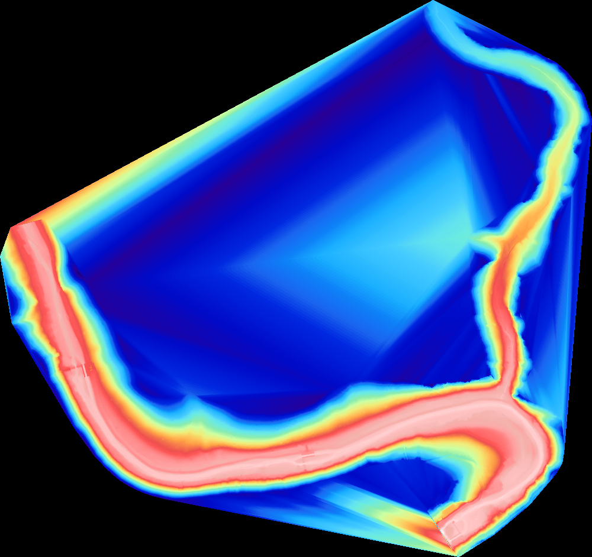
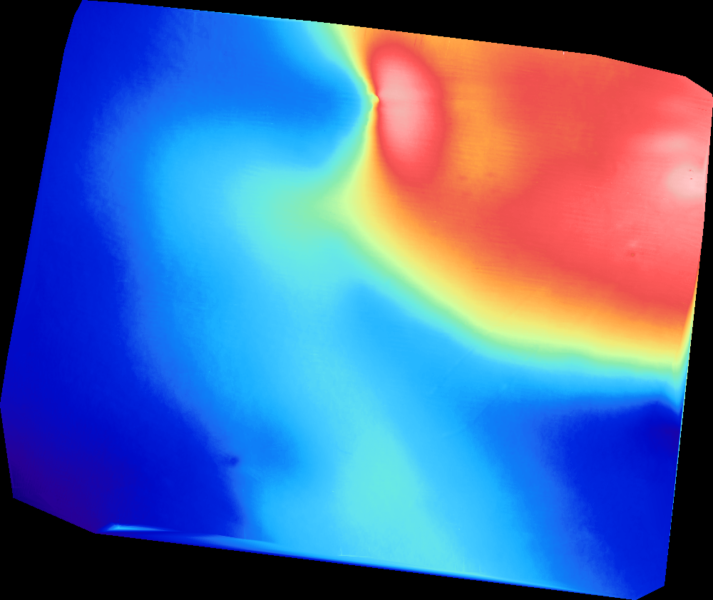
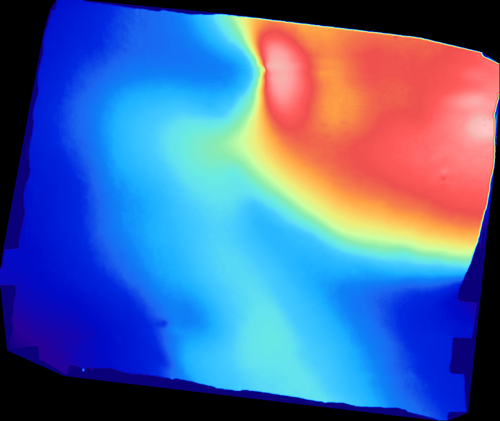
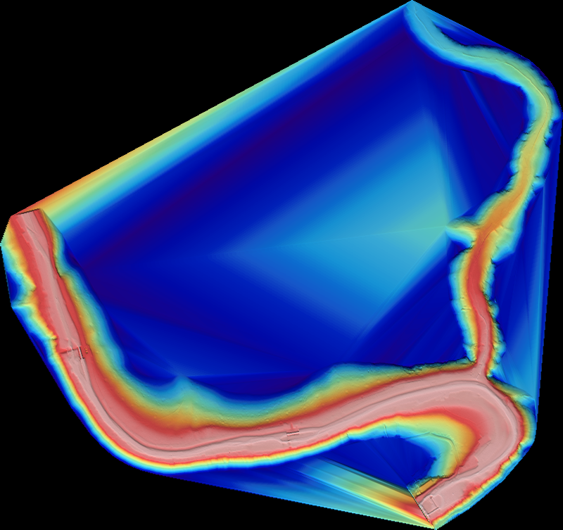

# Projet MNT — Rendu de Modèle Numérique de Terrain en C++



Ce projet C++ transforme un fichier de points MNT (latitude, longitude, altitude) en une image au format **PPM**. Il suit la méthodologie décrite dans le sujet du cours de C++ de l'ENSTA Bretagne de seconde année en robotique autonome. (cf. le document du cours : https://www.simon-rohou.fr/cours/c++/doc/06/cpp_06_projet_carte.pdf).

## Résultats attendus

À partir d’un fichier `lat lon alt`, le programme produit :

- un **fichier PPM** prêt à être visualisé ;
- une **palette de couleurs** (Haxby) pour donner du relief ;
- un **ombrage Lambertien** pour accentuer les structures terrain.

Quelques exemples sont fournis dans `docs/`.

## Table des matières

- [Objectif et principe général](#objectif-et-principe-général)
- [Fonctionnalités](#fonctionnalités)
- [Prérequis](#prérequis)
- [Compilation](#compilation)
- [Utilisation](#utilisation)
- [Format du fichier MNT](#format-du-fichier-mnt)
- [Pipeline détaillé (fonctions et classes)](#pipeline-détaillé-fonctions-et-classes)
- [Option de prétraitement Fourier](#option-de-prétraitement-fourier)
- [Sorties et performances](#sorties-et-performances)
- [Rendus](#rendus)
- [Structure du projet](#structure-du-projet)
- [Dépannage (FAQ)](#dépannage-faq)
- [Licence](#licence)

## Objectif et principe général

Le but est de produire un raster lisible (image) à partir d’un nuage de points terrain. Le pipeline global est :

1. **Lecture** du fichier MNT (points `lat lon alt`).
2. **Projection** des coordonnées géographiques en métrique (PROJ).
3. **Triangulation de Delaunay** des points projetés.
4. **Indexation spatiale** des triangles dans une grille.
5. **Interpolation** sur une grille de pixels.
6. **Ombrage** (hillshade) et **colorisation** (palette Haxby).
7. **Écriture** de l’image PPM (P6).

Le binaire principal s’appelle `create_raster`.

## Fonctionnalités

- Lecture d’un fichier texte `lat lon alt`.
- Projection géographique via **PROJ**.
- Triangulation de Delaunay des points projetés.
- Rasterisation sur grille et génération d’une image PPM (format P6).
- Palette de couleurs (`resources/haxby.cpt`).
- Ombrage de type Lambert pour améliorer le relief. (désactivée par défaut)
- Option de prétraitement Fourier (désactivée par défaut).
- Mesure de temps par étapes (sorties console).

## Prérequis

- Un compilateur C++ (GCC, Clang, etc.)
- CMake ≥ 3.10
- Bibliothèque **PROJ** (`proj`)

Sur Debian/Ubuntu (exemple) :

```bash
sudo apt-get install cmake g++ libproj-dev
```

## Compilation V4 (new version)

L'ajout de l'exécutable `build.sh` permet dans cette version une compilation et une utilisation simplifiée depuis la racine du projet:

- Rendre exécutable :
```bash
chmod +x build.sh
```

- Compilation V4
```
./build.sh
```


## Compilation V3

```bash
mkdir -p build
cmake -S . -B build
cmake --build build
```

L’exécutable généré s’appelle `create_raster`.

## Utilisation

```bash
./build/create_raster <fichier_mnt> <largeur_pixels> [use_fourier] [use_ombrage]
```

Exemples :

```bash
./build/create_raster Guerledan.txt 800
```

```bash
./build/create_raster Guerledan.txt 800 true"
```

```bash
./build/create_raster Guerledan.txt 800 true false";
```

Le programme génère un fichier PPM dans le répertoire courant :

- `mnt_sans_fourier_sans_ombrage.ppm` (par défaut)
- `mnt_sans_fourier_avec_ombrage.ppm` (si l’ombrage est activé et pas Fourier)
- `mnt_avec_fourier_sans_ombrage.ppm` (si l’option Fourier est activée et pas l'ombrage)
- `mnt_avec_fourier_avec_ombrage.ppm` (si l'option Fourier et l'ombrage sont activés)


### Paramètres

- **`<fichier_mnt>`** : chemin vers un fichier texte contenant une liste de points.
- **`<largeur_pixels>`** : largeur de l’image en pixels. La hauteur est calculée automatiquement en conservant le ratio de l’emprise projetée.
- (facultatif) **`[use_fourier]`** : (true ou false) Spécifie l'utilisation d'une compression par Fourier.
- (facultatif) **`[use_ombrage]`** : (true ou false) Spécifie la présence ou non d'ombrage.


## Format du fichier MNT

Chaque ligne doit contenir trois valeurs numériques séparées par des espaces :

```
<latitude> <longitude> <altitude>
```

Exemple :

```
48.1234 -2.5678 156.2
48.1235 -2.5677 154.9
```

Les lignes vides sont ignorées. Toute ligne mal formée provoque une erreur.

## Pipeline détaillé (fonctions et classes)

Cette section détaille l’enchaînement exact des modules du code source.

### 1) Lecture des données

- **`TerrainData::load_data_from_file`** (`src/terraindata.cpp`) charge le fichier texte.
- Chaque ligne est analysée en `GeoPoint { lat, lon, alt }`.
- Des bornes min/max (lat/lon/alt) sont calculées au fil de la lecture.

### 2) Projection géographique → métrique

- **`Projector`** (`include/projector.hpp`) encapsule PROJ.
- CRS par défaut : WGS84 en entrée, projection Lambert Conformal Conic en sortie.
- **`TerrainProjected`** (`src/terrainprojected.cpp`) projette chaque point et calcule les bornes XY.

### 3) Triangulation de Delaunay

- Les points projetés sont convertis en un tableau de coordonnées `{x0,y0,x1,y1,...}`.
- **`delaunator`** (`include/delaunator.hpp`) calcule les triangles.
- Le résultat est stocké dans **`Mesh2D`** :
  - `coords` (positions 2D)
  - `triangles` (indices de sommets)
  - `alts` (altitude par sommet)

### 4) Indexation spatiale (accélération)

- **`Grid`** (`src/grid.cpp`) découpe la bbox projetée en cellules (`nx`, `ny`).
- Chaque triangle est associé à la/aux cellules qu’il recouvre.
- **`TriangleLocator`** utilise cette grille pour localiser rapidement le triangle contenant un point.

### 5) Interpolation barycentrique

- `TriangleLocator::locate` calcule les coordonnées barycentriques du point dans un triangle.
- `TriangleLocator::interpolate` renvoie une altitude interpolée (si le point est dans la triangulation).
- Les points en dehors du « hull » sont marqués invalides.

### 6) Rasterisation + Ombrage + Couleur

- **`Rasterizer::render_p6_color`** (`src/rasterise.cpp`) parcourt chaque pixel :
  - calcule la position XY (centre de pixel),
  - interpole `z` via `TriangleLocator`,
  - construit une grille `z` + un masque de validité.
- **`Ombrage::compute`** (`src/ombrage.cpp`) calcule un hillshade Lambertien à partir du gradient.
- **`HaxbyColorMap`** (`src/colormap.cpp`) charge la palette et transforme `z` en couleur.
- Le shading assombrit/éclaircit la couleur pour donner du relief.

### 7) Écriture PPM

- **`PPM::write_p6`** (`src/ppm.cpp`) écrit l’image finale au format P6.

## Option de prétraitement Fourier

Le prétraitement Fourier est désactivé par défaut. Il permet de lisser et de sous-échantillonner les points avant la triangulation, ce qui peut accélérer la Delaunay. Il s'active ou se désactive à l'exécution du programme.

Le module **`FourierPreprocess`** (`src/fourier.cpp`) suit ces étapes :

1. **Grille cible** : dimensions calculées à partir de la largeur demandée (`grid_scale`, `pow2_grid`).
2. **Binning** : moyenne des altitudes par cellule (`bin_average`).
3. **Remplissage des trous** : interpolation locale (`fill_missing`).
4. **Filtrage gaussien** : lissage `sigma_px` (`gaussian_separable`).
5. **Sous-échantillonnage** : `sample_step` pour obtenir moins de points.

Paramètres internes disponibles dans `src/main.cpp` :

- `grid_scale`, `fill_iters`, `sigma_px`, `sample_step`, `pow2_grid`.

## Sorties et performances

Le programme affiche des temps indicatifs (lecture, Delaunay, etc.) et confirme le fichier généré :

```
Enregistré sous : mnt_sans_fourier_sans_ombrage.ppm (800xXXX)
```

Les performances dépendent du nombre de points et de la largeur demandée. En cas de temps de calcul élevés :

- réduire la largeur demandée,
- activer le prétraitement Fourier,
- vérifier que le fichier MNT n’est pas excessivement dense.

## Choix techniques (pour aller plus loin)

- **PROJ** assure la conversion entre coordonnées géographiques (lat/lon) et projetées (mètres).
- La **triangulation de Delaunay** garantit des triangles bien formés pour l’interpolation.
- L’**ombrage Lambertien** exploite un gradient local pour simuler une source lumineuse.
- La **palette Haxby** offre un rendu classique pour les MNT et bathymétries.

## Rendus

### Sans prétraitement Fourier


### Avec le prétraitement Fourier


Une différence de 35% de vitesse gagnée est environ estimée.

### Avec ombrage


## Structure du projet

- `src/` : implémentation du pipeline (projection, triangulation, rasterisation, etc.).
- `include/` : en-têtes C++.
- `resources/` : palette de couleurs (ex. `haxby.cpt`).
- `tests/` : réservé aux tests (vide).
- `cpp_06_projet_carte.pdf` : sujet/projet (documentation de contexte).

## Dépannage (FAQ)

- **Erreur d’ouverture du fichier** : vérifier le chemin et les droits du fichier MNT.
- **Ligne mal formée** : s’assurer que chaque ligne contient bien `lat lon alt`.
- **PROJ introuvable** : installer `libproj-dev` et relancer CMake.
- **Image noire** : points hors de l’emprise ou coordonnées mal projetées (vérifier les données).
- **Image déformée** : vérifier l’ordre `lat lon alt` et la projection utilisée dans `projector.hpp`.

## Licence

Projet pédagogique — aucune licence explicite fournie.
